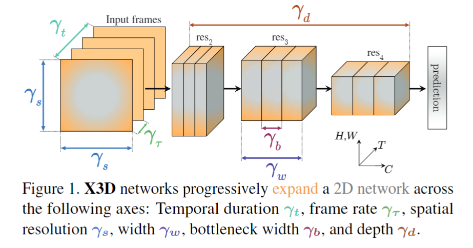
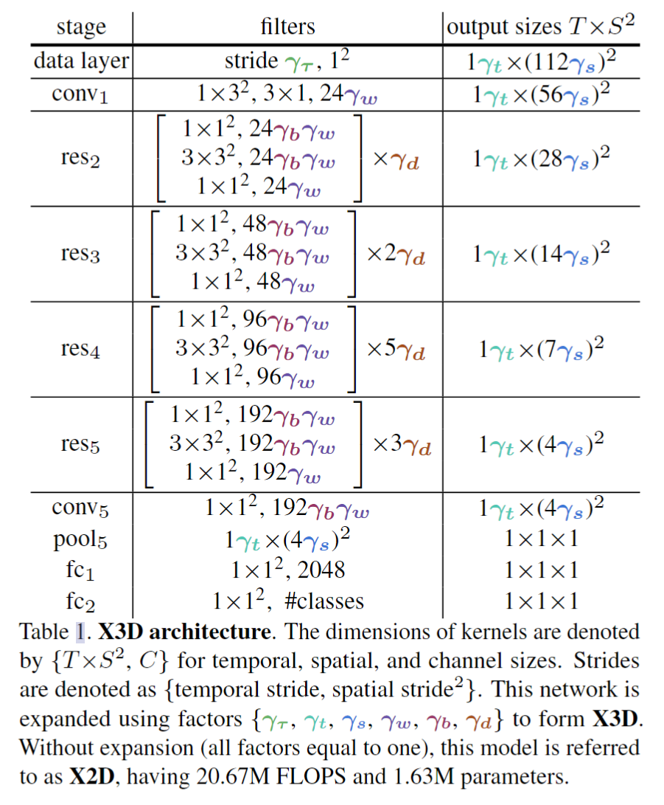
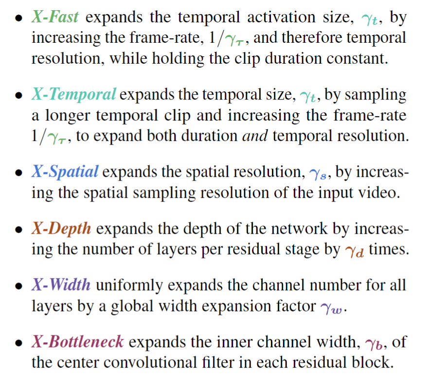
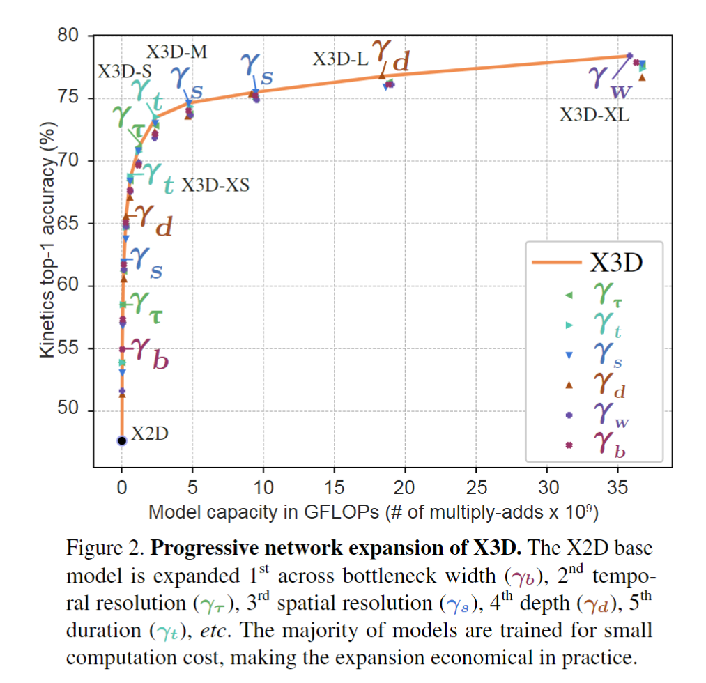
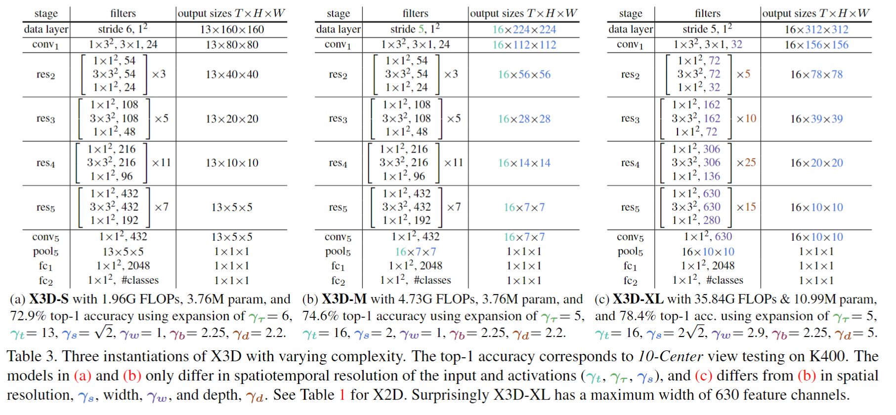
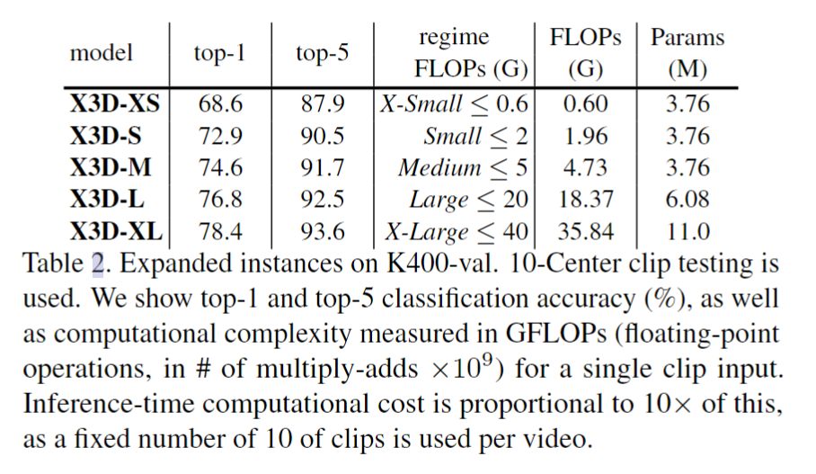
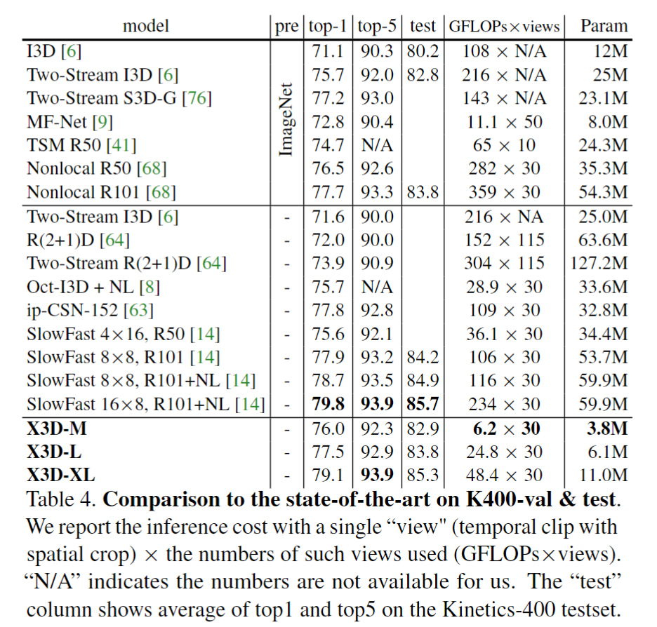
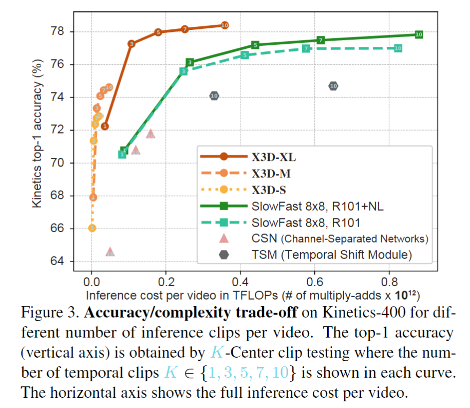

# X3D: Expanding Architectures for Efficient Video Recognition

> Christoph Feichtenhofer. “X3D: Expanding Architectures for Efficient Video Recognition” Computer Vision and Pattern Recognition(2020): n. pag.

## 1. Motivation & Contribution

### 1.1 Motivation

- 之前的方法趋向于将基于图像分类的模型进行时间维度的扩展，同时保留了空间属性。尽管这些方法可以使用图像分类任务进行预训练，但这失去了对视频任务的针对性，也会继承图像分类模型的偏差。
- 作者研究了图像分类模型的发展历程，发现这些模型经历了对网络深度、输入分辨率、通道宽度等的探索，然而对于视频分类模型却缺少相似的研究。其中比较经典的是作者提出的SlowFast模型，他在其中研究了对于slow和fast两个不同分支来说合适的时间、空间和通道分辨率。本文的目的之一也是想探究繁重的slow分支是否必须的，亦或一个足够轻量的分支同样可比。
- 作者认为对小模型在时间维度进行扩张固然可以提升准确率，但是这样的计算量和准确率的权衡并不一定比在其他维度进行扩张好，尤其是低计算量模型，这些模型在不同维度上扩张会快速增加准确率。作者提出了对模型的六个不同维度（采样帧间隔、采样帧数、空间分辨率、网络深度、网络宽度、bottleneck宽度）如何权衡的思考。

### 1.2 Contribution

- 作者通过对图像分类CNN发展历史近些年视频分类CNN缺陷的总结，精简得到了6个关键的维度，通过简单的坐标下降法与贪心策略，同时借鉴了不少轻量级图像模型的优秀设计，如channel-wise卷积、inverted bottleneck、SE等，最后得到了十分高效的X3D系列模型。

## 2. X3D NetWorks

### 2.1 X2D

- 作者首先提出了一个融合了ResNet和fast分支的2D扩张基线模型X2D，输入为单帧图像，即相当于一个图像分类模型。此外，作者借鉴了MobileNet系列模型，将卷积替换为深度可分离卷积，并在Res block 中加入了inverted bottleneck、SE、swish非线性激活函数，使模型更轻量化且高效。

### 2.2 Expansion operations

- 定义了一组基本的扩展操作，用于通过对时间、空间、宽度和深度维度执行以下操作，用于将 X2D 从微小的空间网络扩展到时空网络X3D。

### 2.3 Progressive Network Expansion

#### 2.3.1 Forward expansion

- 首先，给定一个初始状态，所有参数取值为1。也给定两个指标，一个是衡量当前扩张因子$\chi=\{\gamma_{\tau},\gamma_{t},\gamma_{\omega},\gamma_{b},\gamma_{d} \}$好坏的,作者取准确率，第二个是复杂度评判因子，作者取浮点运算数，那么目标即为在给定复杂度的条件下，使得准确率最高的扩张因子。
- 然后，每一步只扩张一个维度，其他维度保持常数，而每一步最好的扩张因子被保留，接着进行下一步扩张。再者，每一步的扩张是渐进式的，也即复杂度约2倍增长。这种方法可以看成是坐标下降法(coordinate descent)的特殊形式.

#### 2.3.2 Backward contraction

- 因为前向扩张是离散地对不同维度进行扩张，在某一步进行扩张时，可能会因为上一步的前向扩张导致复杂度不满足条件，由此回溯。如上一步增加采样帧率为两倍，则回溯使的采样帧率小于两倍。

### 2.4 Trade-off curve for the expansion process

- 从扩张曲线上可以得到一些观察结果：
  - 扩张任意一个维度都增加了准确率。
  - 第一步扩张的不是时间维度，而是bottleneck宽度，这验证了MobileNetV2中的倒置残差结构，原因可能是这些层使用了channel-wise卷积十分轻量，因此首先扩张这个维度比较economical。且不同维度准确率变化很大，扩张bottleneck宽度达到了55.0%，而扩张深度只有51.3%。
  - 第二步扩张的为帧数（因为最初只有单帧，因此扩展采样帧间隔和帧数是等同的），这也是一般认为“最应该在第一步扩张的维度”，因为这能提供更多的时间信息。
  - 第三步扩张的为空间分辨率，紧接着第四步为深度，接着是时间分辨率（帧率）和输入长度（帧间隔和帧数），然后是两次空间分辨率扩张，第十步再次扩张深度，这符合直观的想法，扩张深度会扩张滤波器感受野的大小。
  - 尽管模型一开始十分tiny（宽度比较小），但直到第十一步，模型才开始扩张全局的宽度，这使得X3D很像SlowFast的fast分支设计（时空分辨率很大但宽度很小），最后图里没显示扩张的两步为帧间隔和深度。

### 2.5 A set of X3D architectures

- 随着扩展步数的增大，得到了一系列对应规模逐渐增大的模型。

## 3. Experiments

