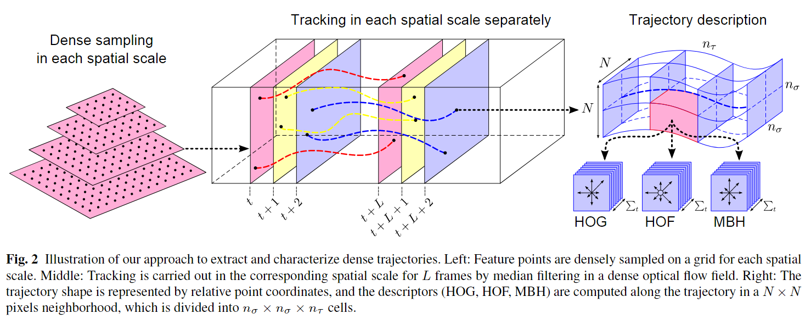
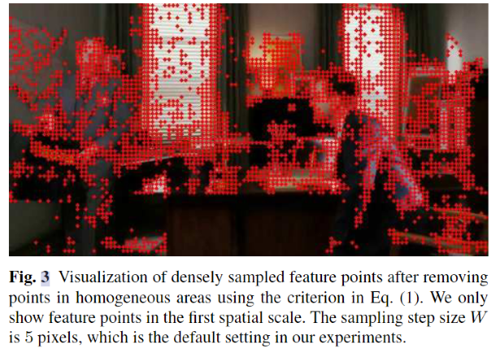
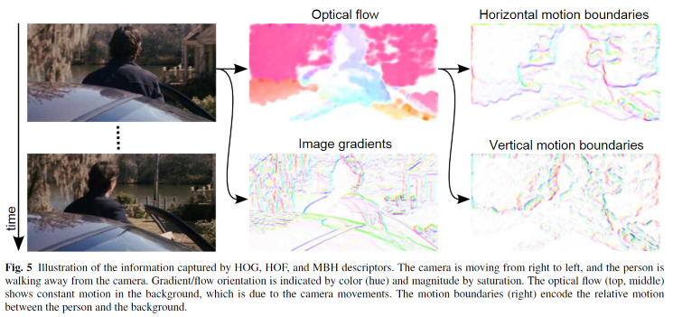
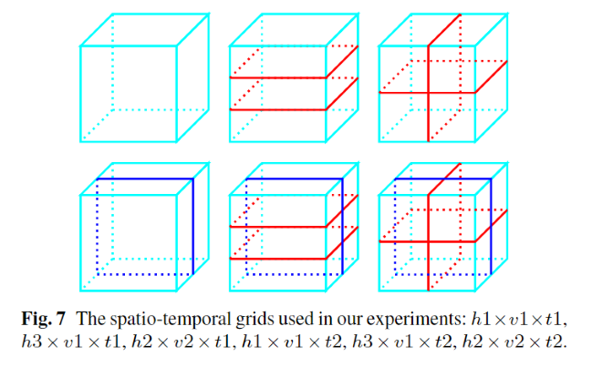
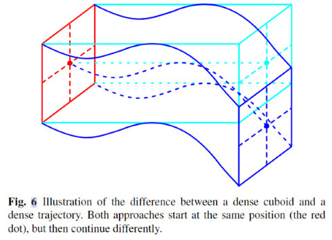
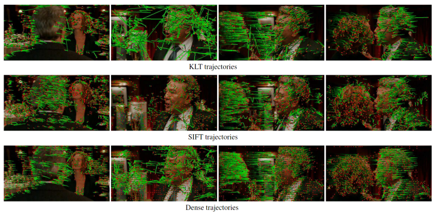
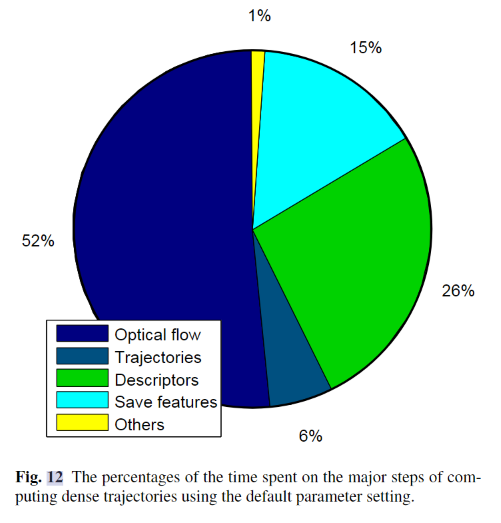

# Dense Trajectory(IDT前作)

> Heng Wang et al. “Dense Trajectories and Motion Boundary Descriptors for Action Recognition” International Journal of Computer Vision (2013): n. pag.

## 1. Motivation & Contribution

### 1.1 Motivation

- 之前的一些手工特征尝试将2D spatial特征扩展到3D spatial-temporal特征，但是这些方法忽视了空间域和时间域的特征在视频中具有不同的特点。
- 类似STIP特征受限于只能提取固定3D范围的特征，而且检测出的STIP往往很稀疏并且集中于运动信息显著的区域。
- 而跟踪轨迹则能在整个时间段上捕捉运动信息，通过将密集采样和跟踪轨迹结合起来可以弥补上述缺陷，并且相比于采用稀疏跟踪器(KLT)能提高轨迹跟踪效果。
- 之前大部分基于局部特征的动作识别并没有考虑相机移动，MBH特征可以有效减少相机移动的影响。

### 1.2 Contribution

- 提出了一种基于密集轨迹的视频特征。
- 提出了一种在轨迹对齐领域提取梯度直方图HOG，光流直方图HOF和运动边界直方图MBH的方法，可以有效减少相机运动的影响。
- 在9个数据集上做了大量消融实验，详细分析了该方法的方方面面，使人信服。

## 2. Approach to dense trajectories

### 2.1 Dense sampling

- 在多个空间尺度上通过网格划分的方式密集采样获取特征点。采样间隔W(即网格大小)设为5个pixels，空间尺度缩放比例为$1/\sqrt{2}$。总共最多8个空间尺度，具体取决于视频分辨率。
- 位于缺乏变化的均匀区域中的特征点在时序中可能没有变化，无需跟踪，所以需要去除这些特征点。本文采用的方法是计算每个像素点自相关矩阵的特征值$(\lambda^1_i,\lambda^2_i)$，并设置阈值$T$去除低于阈值的特征点,系数取0.001是平衡采样点的显着性和密度之间的折衷取值。

$$ T = 0.001 \times \underbrace{\max}_{i \in I}\min(\lambda^1_i,\lambda^2_i)$$

### 2.2 Trajectory

#### 2.2.1 Trajectory tracking

- 轨迹在下一帧的位置由经3x3中值滤波M平滑后的光流场$\omega_t=(u_t,v_t)$计算得到。
  $$ P_{t+1}=(x_{t+1},y_{t+1})=(x_t,y_t)+(M * \omega_{t})|_{(x_t,y_t)} \space ,\space \omega_t=(u_t,v_t)$$
- 轨迹在跟踪过程中会出现漂移现象(即下一帧特征点位置不在W x W的领域内)，因此需要重新采样特征点并将其加入轨迹队列。并且将轨迹长度设为15帧，每隔15帧重新采样。
- 在轨迹后处理阶段，对所有轨迹剪枝。静态轨迹将被移除，而具有突然大位移的轨迹(即相邻两帧之间的位移大于轨迹总位移的70%)也将被排除在外。

#### 2.2.2 Trajectory shape descriptor

- 轨迹形状描述子是将局部运动信息进行编码。
- 对于一个长度为L帧的轨迹，其形状$T$可以用相邻两帧之间的位移向量序列($\Delta P_t,\dots,\Delta P_{t+L-1}$)来表示，并将其归一化。
$$\Delta P_t=(P_{t+1}-P_t)=(x_{t+1}-x_t,y_{t+1}-y_t)$$
$$ T=\frac{(\Delta P_t,\dots,\Delta P_{t+L-1})}{\sum_{j=t}^{t+L-1}\|\Delta P_j \|}$$

### 2.3 Motion and structure descriptor

#### 2.3.1 Space-time volume

- 在与轨迹对齐的$N\times N\times L$的领域时空体内提取特征。
- 前人的工作通常在STIP附近提取局部特征，但忽略了视频内在的动态结构。因此，本文将$N\times N\times L$的时空体进一步划分为$n_{\sigma}\times n_{\sigma} \times n_{\tau}$的时空网格,然后在这些网格中提取HOG、HOF、MBH特征。
- 本文中$N=32,L=15,n_{\sigma}=2 ,n_{\tau}=3 $

#### 2.3.2 Feature descriptor

- HOG用于获取静态外观信息，HOF用于获取局部运动信息，MBH用于消除相机移动的影响,对动作识别更具辨别力。
- HOG：梯度方向量化为8个方向块(即直方图有8个bins)，梯度的幅值作为直方图bins的权重。HOG特征共96个维度(i.e.,$2\times2\times3\times8$)。
- HOF：光流方向量化为8个方向块，梯度的幅值作为直方图bins的权重，直方图共有9个bins。前8个bins于HOG相同，额外的一个bin用于统计光流幅度小于某个阈值的像素个数。HOF特征共108个维度(i.e.,$2\times2\times3\times9$)。
- MBH：在光流图的水平方向和垂直方向上计算梯度直方图。MBH特征共192个维度(i.e.,$2\times2\times3\times8\times2$)。
- 最后使用L2范数对3个特征进行归一化。

#### 2.4 Feature encode —— bag of features

- 每段轨迹都包含一组特征(trajectory,HOG,HOF,MBHx,MBHy)，使用bag of feature分别对5个特征编码，以获得5个定长的编码特征用于分类。
- bag of features流程：
   1. 在训练集中提取所有的特征；
   2. 随机选取100000个特征进行k-means聚类，设有4000个聚类中心(即视觉单词)，这些聚类中心构成了一个字典；
   3. 将所有特征按最小欧氏距离分配给聚类中心，这些聚类中心与对应簇中的个数构成了一个直方图(即编码特征向量)；
   4. 将编码后的5个编码特征按多通道的方式进行组合，最后采用SVM(RBF Kernel)进行分类，分类策略为one-against-rest(假设有n个类别，那么就会建立n个二项分类器，每个分类器针对其中一个类别和剩余类别进行分类)。

#### 2.5 Spatio-temporal pyramids

- 为了在使用bag of features时加入结构信息，本文采用了时空金字塔，构造了6种不同的网格结构。
- 在每种网格结构中的每个单元格cell内分别计算bag of features 编码特征，并将所有sell的特征堆叠(concatenation)到一起。
- 至此，一段视频可以用30个通道表示(6 grid structure x 5 descriptor types)。

## 3. 对比实验

### 3.1 Baseline trajectory

#### 3.1.1 KLT trajectories

- 跟踪过程：
  - 在第一帧检测Harris角点，大约100个特征点，也可以降低阈值获取更多的特征点
  - 在连续帧之间每一个角点通过平移或仿射进行运动估计
  - 连接连续帧中的运动矢量，得到每一个角点的轨迹
  - 对于各特征点，在各帧中判断其跟踪的好坏。有些特征点可以移除（比如去除掉那些被遮挡的或者无法准确跟踪的），也可以周期性（如每隔15帧）开始新一次轨迹跟踪。
- 特点：
  - 难以处理快速不规则的运动

#### 3.1.2 SIFT trajectories

- 跟踪过程：
  - 在第一帧提取SIFT特征点
  - 下一帧的最佳跟踪匹配点是邻域内SIFT描述子之间欧氏距离最小的点
- 特点：
  - 对于镜头边界有较好的鲁棒性
  - 难以捕捉视频中复杂微小的运动变化

#### 3.1.3 Dense cuboids

- 与dense trajectory唯一不同之处是提取特征的时空体未与轨迹对齐，而是一个长方体。

### 3.2 实验结果

#### 3.2.1 不同特征间比较

1. 本文首先在9个数据集上对比了轨迹的5个不同特征(Trajectory,HOG,HOF,MBH,Combined)的分类效果。在大部分数据集上MBH的效果优于HOG和HOF，而Combined特征能进一步提高性能。
2. 然后在HMDB51数据集上测试了视频稳定对不同特征的影响，实验结果表明MBH在原视频和平稳处理后的视频上的分类效果提升不大，显示了其对相机运动的鲁棒性。
3. 本文还与使用3DHarris检测器检测的时空兴趣点周围提取特征做对比，实验结果表明HOG,HOF特征分类效果略微提升，而MBH提升巨大。

#### 3.2.2 不同baseline轨迹

1. 本文比较了9个数据集上采用不同特征的baseline轨迹的分类效果，实验结果表明dense trajectory相较于KLT轨迹，SIFT轨迹和dense cuboids能更好地捕捉视频中的动态信息。
2. 本文还测试了增加KLT和SIFT特征点数量的效果，实验结果表明分类效果会略微提高，然后达到饱和。

#### 3.2.3 不同轨迹参数

1. 本文究了轨迹长度、采样步长、邻域大小、网格结构、采样空间尺度数和刷新率（及时采样特征点的帧速率）的影响。
2. 实验表明轨迹长度在15-20帧效果较好，既不能太短(获取足够的运动信息)，也不能太长(在跟踪过程中很可能从初始位置漂移或越过镜头边界)。
3. 实验表明采样越密集效果越好，但是计算也会随之变得复杂，需要平衡速度和准确率。
4. 实验表明领域大小不能过大，因为可能会重叠。
5. 实验表明网格结构中每个方向划分为2份效果最好，更细的划分效果提高不大。
6. 实验表明采样空间尺度数在5或6层后性能饱和。
7. 实验表明不同数据集对刷新率的敏感程度不同，运动丰富且镜头经常切换的数据集需要每帧都采样，而镜头相对固定、运动不剧烈的数据集可以降低刷新率。

#### 3.2.4 计算复杂度

1. 本文分析了计算dense trajectory 各阶段的计算复杂度，实验表明计算光流最耗时，耗时第二多的是特征的提取(如果只提取MBH则可节约一半的特征提取耗时)，由于轨迹较密集所以存储特征也要花费不少时间。

#### 3.2.5 有无时空金字塔(spatio-temporal pyramids,STP)

- 在各个数据集上与当前最优的方法做对比，实验表明dense trajectory 在大多数数据集上表现最好。此外，采用STP能在大多数情况下提高分类效果。

## 4. Feature work

- 可以采用其他的特征编码方式,比如Fisher Vector。
- DT算法的性能受限于光流图像的质量，需要进一步消除背景和相机运动带来的干扰因素。
- DT特征可以应用于视频定位和视频检索等其他领域，也可以应用于更大规模的数据集。
