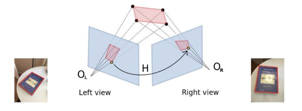
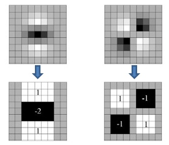
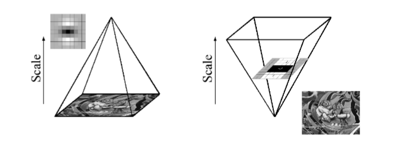
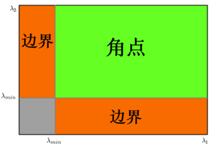
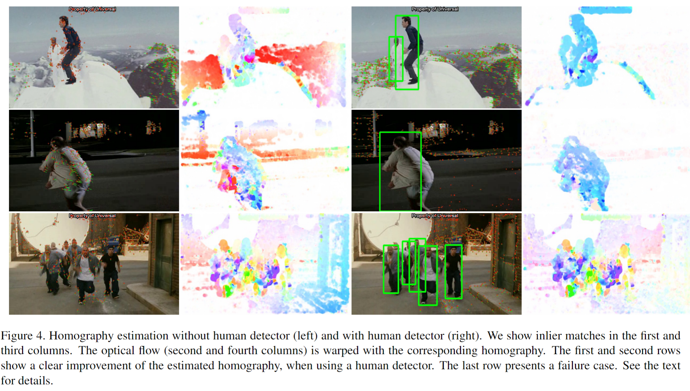

# Improved Dense Trajectory

> Heng Wang and Cordelia Schmid. “Action Recognition with Improved Trajectories” international conference on computer vision (2013): n. pag.

## 1. Motivation & Contribution

### 1.1 Motivation

- 虽然前作Dense Trajectory已经通过在与轨迹对齐的时空领域内提取MBH特征，一定程度上减少了相机运动的影响，但是仍然在背景中产生了不少的不相关光流和轨迹。
- 如果能够显式的估计相机运动，就能得到视频稳像(video stabilization)的修正光流场，让基于光流场的轨迹特征和运动特征(HOF、MBH)能专注于人物运动信息，从而提高分类效果。
- 由于相邻两帧图像之间变化比较小，iDT算法假设后一帧图像是前一帧图像通过投影变换(homography,单应性矩阵)得到的，而投影变换矩阵可以在两帧图像上获取匹配特征点对后利用RANSAC算法估计。
- 但是人体运动和相机运动差异较大，人体身上的匹配点会引起投影矩阵估计误差，因此需要将人体和背景分割开。

### 1.2 Contribution

- 提出了一种基于SURF特征和稠密光流匹配特征点并用RANSAC算法估计相机运动的方法，并通过利用人体检测器提高匹配精度。
- 提出了一种基于相机运动估计计算稳定光流场的improved dense trajectory

## 2. Related work

### 2.1 Remove camera motion(video stabilization)

1. Uemura et al.[38]将特征匹配与图像分割相结合以估计相机运动，然后将分离背景中的特征轨迹。
2. Wu et al.[42]将特征轨迹分解为相机诱导和物体诱导的分量。
3. Park et al.[27]利用粗粒度光流达到弱视频稳像的效果。

### 2.2 Other improved dense trajectory

1. Viget al.[39]利用显著性图谱去除背景特征。
2. Jiang et al.[15]对密集轨迹做聚类，建模聚类中心间的关系。

## 3. Approach to improve dense trajectory

### 3.1 Camera motion estimation

#### 3.1.1 homography

- 对于全局背景运动，假设连续两帧图像$I_{t},I_{t+1}$存在单应性矩阵$H_{3\times3}$(即投影变换矩阵)。单应性矩阵虽然有9个未知数，但实际只有8个自由度，只需4组点对即可求得。

    $$I_{t+1}=H_{3\times3}\times I_{t} \\
    \\
    \begin{pmatrix}x_i^{'} \\ y_i^{'} \\ 1 \end{pmatrix} = \begin{pmatrix}h_{11} & h_{12} & h_{13} \\ h_{21} & h_{22} & h_{23} \\ h_{31} & h_{32} & h_{33} \end{pmatrix} \begin{pmatrix}x_i \\ y_i \\ 1 \end{pmatrix}
    $$
- 利用$H_{3\times3}$矩阵的逆即可得到校正(warp)后的第二帧图像$I_{t+1}^{wrap}$，用$I_{t}$和$I_{t+1}^{wrap}$即可计算出优化后的光流场。

    $$
    I_{t+1}^{warp}=H^{-1}_{3\times3}\times I_{t}
    $$

#### 3.1.2 generate candidate matches

- 提取每帧(人体边界框外的区域)的SURF特征点和稠密光流
- 提取特征点对应的描述子
- 通过匹配特征点描述子，找到两张图中匹配的特征点对

##### 3.1.2.1 Human mask

- 人体区域提取的匹配特征点会导致误匹配，最终使相机运动估计误差较大。
- 在估计单应性时，使用人体检测器作为掩码去除边界框内的特征匹配。
- 本文采用了一个基于部位的人体检测器，该检测器结合了几个专用于人体不同区域（包括全身、上半身和面部）的部位检测器。
- 但如果画面主要被人体占据，则即使使用了人体检测器相机运动估计也难以准确估计。

##### 3.1.2.2 SURF match

1. 近似Hessian矩阵将二阶高斯微分模板替换为盒式滤波模板，该模板可以采用积分图加速计算，响应函数如下：

    $$Det(H_{approx})=D_{xx}D_{yy}-(\omega D_{xy})^{2} $$

    

2. SURF算法不需要通过降采样的方式得到不同尺寸大小的图像建立金字塔，而是借助于盒式滤波和积分图像，不断增大盒式滤波模板，通过积分图快速计算盒式滤波的响应图像。

    

3. 将经过盒式滤波处理过的响应图像中每个像素点与其3维邻域中的26个像素点进行比较，若是最极大值点，则认为是该区域的局部特征点。然后，采用3维线性插值法得到亚像素级的特征点，同时去掉一些小于给定阈值的点，使得极值检测出来的特征点更鲁棒。
4. SURF特征点方向分配采用的是统计特征点圆形邻域内的harr小波特征。即在特征点的圆形邻域内，统计60度扇形内所有点的水平、垂直harr小波特征总和，然后扇形以0.2弧度大小的间隔进行旋转并再次统计该区域内harr小波特征值之后，最后将值最大的那个扇形的方向作为该特征点的主方向。
5. SURF沿特征点主方向取4*4的矩形区域块，统计每个子块中的haar特征响应值，对响应值统计水平方向值、水平方向绝对值、垂直方向、垂直方向绝对值并以此作为子块特征向量。由于共有4×4个子块，SURF特征描述子的特征维数为4×4×4=64。
6. SURF通过计算两个特征点间的欧式距离来确定匹配度，Surf还加入了Hessian矩阵迹的判断，如果两个特征点的矩阵迹正负号相同，代表这两个特征具有相同方向上的对比度变化，如果不同，说明这两个特征点的对比度变化方向是相反的，即使欧氏距离为0，也直接予以排除。

##### 3.1.2.3 dense optical flow match

- 采用Farneback提出方法，计算稠密光流
- 然后根据good-features-to-track准则选择显著特征点的运动矢量，用于特征点匹配。
- good-features-to-track：Shi-Tomasi 角点检测器，即改良的Harris角点检测。

    $$R=det(M)-k((trace(M)))^2=\lambda_1\lambda_2-k(\lambda_1+\lambda_2)^2 
    $$

    $$ R=min(\lambda_1,\lambda_2) 
    $$

##### 3.1.2.4 Merge two matches

- 结合SURF的匹配和光流的匹配，因为二者是互补的，SURF专注于斑状结构且一定程度上对运动模糊有较好的鲁棒性，而采用good-features-to-track准则的稠密光流侧重于角落和边缘。

#### 3.1.3 RANSAC(随机抽样一致)

1. 随机从数据集中随机抽出4组不共线的匹配点对，计算出单应性矩阵$H$，记为模型$M$；
2. 计算数据集中所有数据与模型M的投影误差，若误差小于阈值，加入内点集 $I$；
3. 如果当前内点集 $I$ 元素个数大于最优内点集 $I_{best}$ , 则更新 $I_{best} = I$，同时更新迭代次数k ;
4. 如果迭代次数大于$k$,则退出 ; 否则迭代次数加1，并重复上述步骤；
5. 得到最优的估计单应性矩阵，即相机运动估计

$$k=\frac{log(1-p)}{log(1-\omega^m)}，p为模型置信度，\omega为内点概率，m为计算模型所需要的最少样本数。$$

#### 3.1.4 warped optical flow(优化光流场)

- 由RANSAC算法得到单应性矩阵后即可对当前帧图像做校正，从而消除相机运动。
- 用校正后的图像重新计算各个尺度上的光流，并以校正后的光流场重新计算优化各个尺度空间上的特征(trajectory,HOF,MBH)。
- 可以通过设置阈值的方式去除背景轨迹。
- HOF在优化光流场上的表现可以与MBH相媲美。

### 3.2 Other improvement

#### 3.2.1 Feature normalization

- iDT特征采用了RootSIFT方法，即先对特征L1正则化后再对特征的每个维度开平方。

#### 3.2.2 Feature encoding

- iDT采用了使用效果比bag of Features更好的Fisher Vector编码。
- Fisher Vector同样也是先用大量特征训练码书(codebook)，再用码书对特征进行编码。

## 4. 实验(略)

## 5. Feature work

- iDT的缺点有特征维度很高，特征文件大小远大于原始视频，以及计算速度慢。因此，后人将iDT特征与CNN相结合，取得了更好的性能。
- 将人体检测器更换为深度学习模型。
