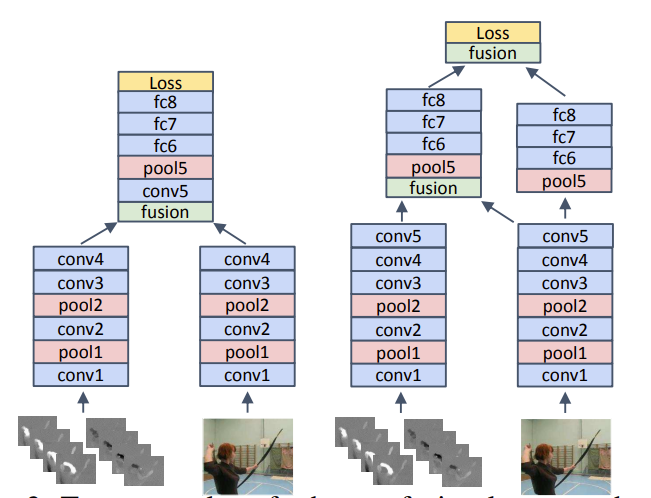
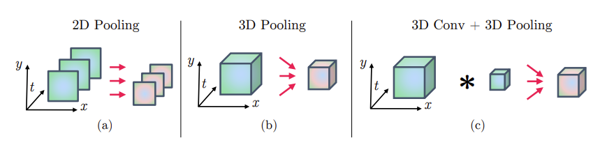
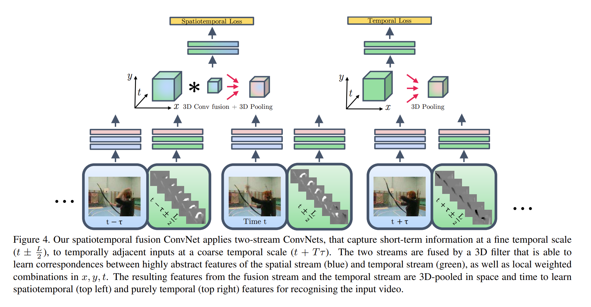

# Two-Stream  Fusion

> Feichtenhofer, C., Pinz, A., & Zisserman, A. (2016). Convolutional Two-Stream Network Fusion for Video Action Recognition. Computer Vision and Pattern Recognition (CVPR), 1933–1941.

## 1. Motivation & Contribution & feature work

### 1.1 Motivation

- Two-stream convolution networks(Simonyan, K., & Zisserman, A. (2014))采用了late fusion在softmax分类层来融合两个网络的结果，但是没有深究空间特征和时间特征之间的像素级联系。
- 此外，双流网络的输入的时间尺度收到限制，只能输入一张静态图像和L个时间相邻的光流帧的堆栈。

### 1.2 Contribution

1. 对如何做spatial fusion 和 temporal fusion,以及在网络中哪层做fusion做了大量消融实验。实验结果表明，采用在网络的最后一层卷积层使用3D Conv 和 3D Pooling 做early fusion效果较好。
2. 尝试了3D Pooling 和 3D Conv，推动了3D CNN的发展
3. 根据消融实验结果，设计了一个新的网络结构。

### 1.3 Feature work

1. 现有数据集(UCF101,HMDB51)规模太小且噪声多，因此需要新的数据集。此文发表1年后，I3D和Kinetics300被提出。

## 2. Fusion approaches

- 通过大量消融实验，探究了spatial fusion 和 temporal fusion，以及where to fusion

### 2.1 Spatial Fusion

- 在特征图层面做fusion,使得空间流和时间流的特征图在同一像素上产生的通道响应能联系起来。也就是将所有通道堆叠到一起，然后用一种滤波器学习各个通道间的联系，就像学习卷积核里的权重。

1. Sum fusion

    $$ y^{sum}_{i,j,d}=x^{a}_{i,j,d}+x^{b}_{i,j,d} $$

2. Max fusion

    $$y^{max}_{i,j,d}=\max\{x^{a}_{i,j,d}, x^{b}_{i,j,d} \} $$

3. Concatenation fusion

   - 将两层特征图做堆叠

    $$y^{cat}=f^{cat}(x^{a},x^{b})
    \\ y^{cat}_{i,j,2d}=x^{a}_{i,j,d} \\
    y^{cat}_{i,j,2d-1}=x^{b}_{i,j,d}$$

4. Conv fusion

   - 将两层特征图做堆叠后做1x1x2D的卷积操作,输出一个D通道的融合特征图，从而在同一像素位置建模两张特征图的加权组合。

   $$y^{conv}=y^{cat}*f +b \space\space\space\space ,\space f \in \R^{1\times1\times2D\times D},\space b\in \R^{D} $$

5. Bilinear fusion

   - 遍历两张特征图各个通道，对同一位置做外积运算，然后做一次sum pooling，缺点是计算复杂度过高。

    $$ y^{bil}=\sum^{H}_{i}\sum^{W}_{j}x_{i,j}^{a}\otimes x^{b}_{i,j} \space ,\space y^{bil}\in \R^{D^{2}}$$

### 2.2  Where to fuse the two streams spatially

1. 做了大量消融实验，比较了early fusion,late fusion,multiple fusion三种方式。
2. 实验结果表明过早的做early fusion不可取，最好是在最后一层卷积层后做fusion。
3. 此外，实验结果表明多次fusion效果不佳，因为fusion次数增加势必会导致过早地early fusion。
4. 作者提出了两种效果较好的fusion方式，一种是在最后一层卷积层后只做一次fusion，一种是前一种的基础上在最后一层FC层后增加一次fusion。第二种方式效果提升不大，但参数量是第一种的两倍。
    

### 2.3 temporal fusion

1. 3D Pooling:该方法是2D pooling的维度扩展，采用3x3x3的max pooling实现。3D pooling 能使得位置随时间发生微小变化的特征具有不变性。
2. 3D Conv + 3D Pooling:先做3x3x3的3D conv,然后再做3D pooling。3D conv 能学习对中心时间样本进行中心加权，或者在时间或空间上进行区分。

## 3. Proposed architecture

- 有两个网络分支，一个为时空流网络，一个时间流网络。
- 间隔一个粗粒度时间间隔($t+T\tau$)采样提取空间特征，然后在该帧附近用细粒度时间间隔($t\pm \frac{L}{2}$)提取L帧光流特征。总计输入T张空间特征图和T*L张光流特征图，若$\tau < L$会导致重复输入。
- 在最后一层卷积层后采用3D Conv 和3D Pooling将空间流和时间流融合为一个时空流网络。
- 在最后一层卷积层后采用3D Pooling 将空间流和时间流融合为一个时间流网络。
- 最后对两个流网络的输出做一次加权平均的late fusion得到最后的分类结果。
- 

## 4. 实现细节

1. 总体与双流网络训练相差不大，两个分支都在ImageNet上做pre-train,然后在UCF101和HMDB51上fine-tune。提前计算光流场并存储为JPEG。backbone采用VGG-M-2048 和VGG-16。
2. 不同之处
   - 未对数据做颜色增强；
   - 在验证误差饱和后降低学习率；
   - 前两层FC层采用更低的丢弃率；
   - 训练时不做最后分类结果的late fusion,因为两个网络学习速度不一样；
   - 采用了新的数据增强，先对输入做$\pm25\%$的尺寸抖动，然后再做resize。

## 5. 消融实验过程(略)
