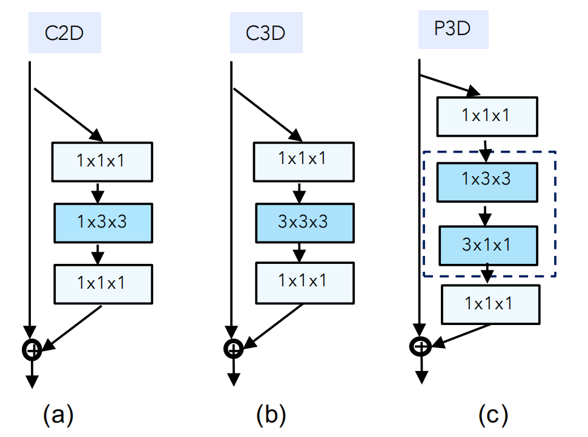
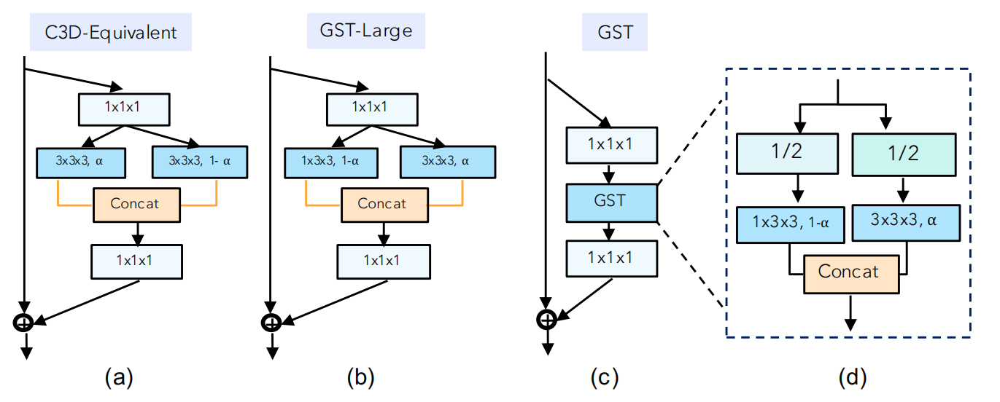
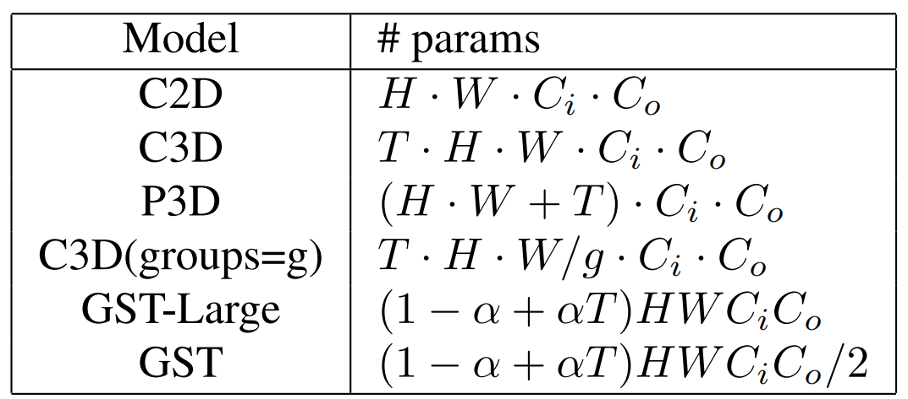
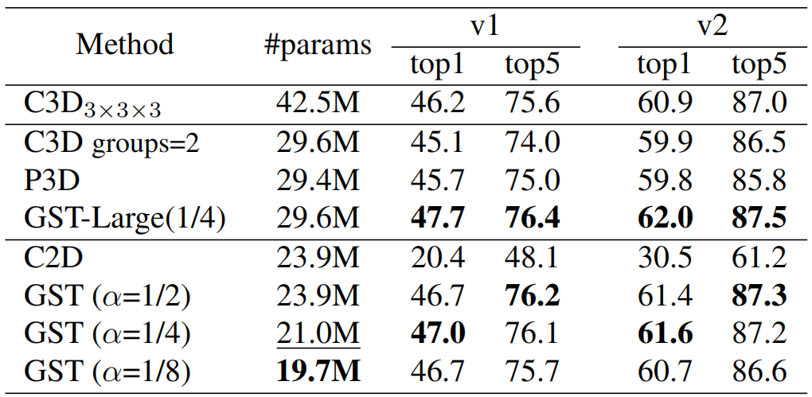

# 分组时空聚合（GST）

> Luo C, Yuille A L. Grouped spatial-temporal aggregation for efficient action recognition[C]. Proceedings of the IEEE/CVF International Conference on Computer Vision. 2019: 5512-5521.

## 一、引言

1. 3D 卷积的计算成本大，人们通过解耦空间和时间滤波器来降低复杂度。

   

2. 分组时空聚合（GST）在卷积时分解空间和时间通道，分别关注静态和动态特征。

3. 在数据集上 UCF101 和 Kinetics 注重静态特征，但粒度更细的 Jester，Diving48 和 sth-sth 需要有效的时间建模。

4. 类比视神经元 Parvo 和 Magno 细胞的不同功能，猜想可能部分通道注重时间特征，部分通道注重空间特征。

5. 与 P3D 的级联分解不同，GST 的时空分解是并行实现的。

6. 研究贡献：

   （1）一种新的 3D 卷积核分解方法用于分解时间和空间特征。

   （2）定量分析不同层中时间和空间特征的贡献。

   （3）在需要时间建模的数据集上取得更好效果。

## 二、分组时空聚合（GST）

1. 时空分组：类似于 ResNext 和 ShuffleNet 的组卷积，将输出通道分为两组，一组用于空间建模，一组用于时间建模。空间通道执行 C2D，时间通道执行 C3D（原因是直接的将原始卷积替换成组卷积（Res3D）容易导致对称组），然后将时空特征连接在一起。

   

2. 参数对比：

   

3. GST 可以简单地嵌入到其他网络框架中替换原先的 3D 卷积层。

## 三、结果

