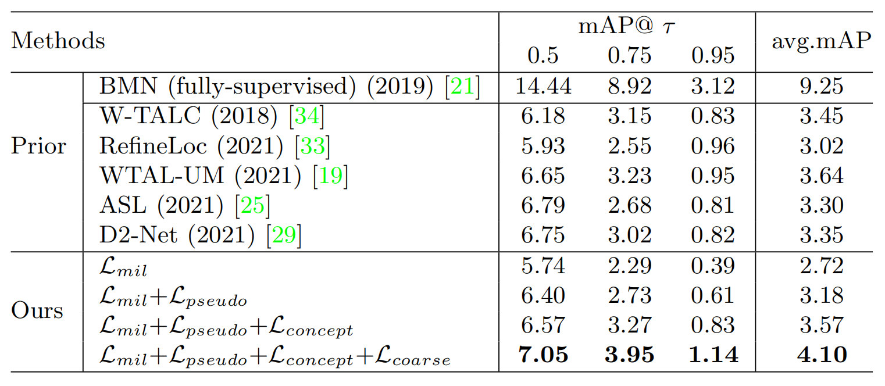

# 弱监督原子动作模型

> Li Z, He L, Xu H. Weakly-Supervised Temporal Action Detection for Fine-Grained Videos with Hierarchical Atomic Actions[C]. Computer Vision–ECCV 2022: 17th European Conference, Tel Aviv, Israel, October 23–27, 2022, Proceedings, Part X. Cham: Springer Nature Switzerland, 2022: 567-584.

## 一、引言

1. 弱监督：将动作建模为原子动作组合，而原子动作由自监督聚类从数据中自动发现。

2. 多实例学习（MIL）：基于视频级的动作分类。

   分类信号（classification signals）：具有高激活分数的部分，作为动作片段。选择方法包含 k-max 池化、基于注意力的池化等。

   改进：添加不同的正则化损失、约束或时间属性建模。

   存在的问题：细粒度视频在视觉上的相似性，分类困难。

3. 动作边界：越细的动作边界越模糊，越不可信。因此本文仅使用视频级的动作标签而不使用动作发生的时间。

## 二、方法

1. 主线：多实例学习（MIL）：

   （1）视频分为 T 个短视频段，使用编码器 E 提取特征 x（T \* d）。

   （2）使用细粒度级的分类器获取预测分数 s（T \* C）。

   （3）使用以均值为阈值的池化得到细粒度级的预测分类（T \* C）。
   $$
   \hat{y^{j}}=\frac{1}{\sum_{i=1}^{T}\boldsymbol{1}(s_{i}^{j}\ge \bar{s^{j}})}\sum_{i=1}^{T}\boldsymbol{1}(s_{i}^{j}\ge \bar{s^{j}})\cdot s_{i}^{j}
   $$

2. 改进点：视觉概念（Visual Concept）：

   视觉概念对应着自监督得到的原子动作。

   （1）使用聚类得到原子动作的伪标签，并据此训练视觉概念分类器 F。

   （2）对于相同伪标签的 x 求平均得到原子动作的视觉概念 v（即聚类中心）。
   $$
   v_{n}=\frac{1}{\sum_{i=1}^{T}\boldsymbol{1}(p_{i}=n)}\sum_{i=1}^{T}\boldsymbol{1}(p_{i}=n)\cdot x_{i}
   $$
   （3）将 v 与细粒度级的分类器的权重求距离，得到与精细动作 j 最相关的 K 个原子动作，再通过组合函数 C 构成该精细动作的视觉表示 e。
   $$
   d_{j}^{n}=D(v_{n},w^{j})\\
   e^{j}=C(\{v_{n}|n\in TopK(D^{j})\})
   $$
   （4）根据“粗略 - 精细“的映射关系 O 得到粗略动作 u 的视觉概念 e\' 。
   $$
   e'_{u}=C'(\{e^{j}|j\in O_{u}\})
   $$
   （5）e\' 通过粗粒度级的分类器得到粗粒度级的预测分类。

## 三、结果

