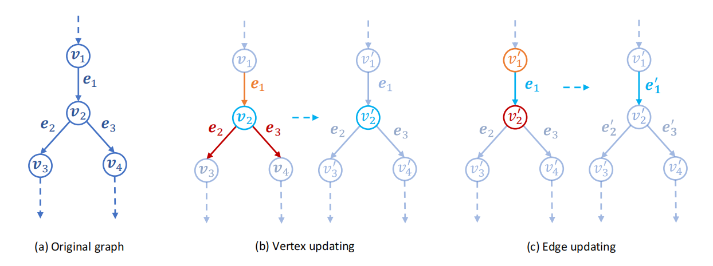
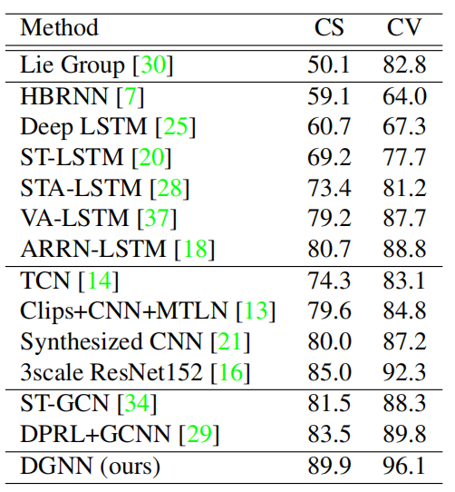

# 有向图神经网络（DGNN）骨架识别

> Shi L, Zhang Y, Cheng J, et al. Skeleton-based action recognition with directed graph neural networks[C]. Proceedings of the IEEE/CVF conference on computer vision and pattern recognition (CVPR). 2019: 7912-7921.

## 一、引言

1. 骨架（Skeleton）数据：关节 + 骨骼信息。

   骨架数据的优势：不受身体比例、运动速度、摄像机视点和背景的干扰。

2. 骨架数据的传统方法：关节角度、关节间距离和运动历史图像。

3. 研究动机：传统方法难以处理涉及多人的复杂动作或动作序列中的细粒度动作，需要一种新方法捕捉身体各部位之间的空间和时间依赖关系，同时在训练过程中保持自适应性。

4. 文章贡献：

   （1）基于自然人体关节和骨骼之间的运动学依赖性，提出一种将骨架数据表示为**有向无环图（DAG）**的新方法。

   （2）设计一个新的**有向图神经网络 (DGNN)**，该网络可以从构造的 DAG 中提取关节、骨骼和关系信息，用于动作识别任务。

   （3）在训练过程中使 DAG 的拓扑结构具有**适应性**，从而显著提高性能。

   （4）通过使用**双流框架**将空间和时间特征相结合，帮助识别。

   （5）在两个大规模数据集上取得最先进的结果：NTU-RGBD 数据集和 Skeleton-Kinetics 数据集。

## 二、DGNN

1. 有向无环图（DAG）提取：每个关节都表示为一个节点 v，而边表示节点之间的骨骼连接：
   $$
   e_{v_{1},v_{2}}=v_{1}-v_{2}=(x_{1}-x_{2},y_{1}-y_{2},z_{1}-z_{2})
   $$
   使用邻接矩阵对这些信息进行编码，以便在训练过程中进行有效的计算。

   

2. DGNN：在每一层中，顶点和边的属性根据其相邻的顶点和边进行更新。
   $$
   \begin{aligned}
   & \overline{\mathbf{e}}_i^{-}=g^{\mathbf{e}^{-}}\left(\mathcal{E}_i^{-}\right) \\
   & \overline{\mathbf{e}}_i^{+}=g^{\mathbf{e}^{+}}\left(\mathcal{E}_i^{+}\right) \\
   & \mathbf{v}_i^{\prime}=h^{\mathbf{v}}\left(\left[\mathbf{v}_i, \overline{\mathbf{e}}_i^{-}, \overline{\mathbf{e}}_i^{+}\right]\right) \\
   & \mathbf{e}_j^{\prime}=h^{\mathbf{e}}\left(\left[\mathbf{e}_j, \mathbf{v}_j^{s ^{\prime}}, \mathbf{v}_j^{t^{\prime}}\right]\right)
   \end{aligned}
   $$
   以邻接矩阵表示：
   $$
   \begin{aligned}
   & \mathbf{f}_v^{\prime}=H_v\left(\left[\mathbf{f}_v, \mathbf{f}_e \tilde{A}^{s^{\textrm{T}}}, \mathbf{f}_e \tilde{A}^{t^{\textrm{T}}}\right]\right) \\
   & \mathbf{f}_e^{\prime}=H_e\left(\left[\mathbf{f}_e, \mathbf{f}_v \tilde{A}^s, \mathbf{f}_v \tilde{A}^t\right]\right)
   \end{aligned}
   $$

3. Adaptive DGN block：预先在 A 上添加可训练参数 P，构建原始骨架中不存在的边。

4. 时间信息建模：在更新空间骨骼信息后使用时间卷积块（TCN），1D conv + BN + ReLu。

5. 双流架构：类比光流提出“骨骼形变”的概念：关节的运动用关节点的坐标变化表示，骨骼的形变用边向量的矢量差表示。“骨骼形变”送入另一条DGNN流中。

## 三、结果（NTU-RGBD）

- Cross-subject（CS）：在不同的人之间识别人体骨骼动作。
- Cross-view（CS）：在不同的摄像机视角下识别人体骨骼动作。

# 附：Convolution-free (CF) 网络总结

1. 卷积神经网络（CNN）是深度学习中最常用的神经网络之一，在图像分类、物体检测和图像分割等计算机视觉任务中表现出色。但是，CNN 需要执行大量的卷积操作，这会导致计算成本很高。

2. Convolution-free (CF) 神经网络是一种替代 CNN 的方法，通过**避免使用卷积来减少计算成本**，并在计算资源受限的环境下提高模型的性能。

3. CF 网络的类型：transformer、graph neural networks（GNN）、fully connected neural networks（FCNN）、Recursive Neural Networks（RNN）、Capsule Networks 等。

   （1）Transformer网络：Transformer是一种使用自注意力机制的神经网络，被广泛应用于自然语言处理和其他序列数据的任务中。

   （2）Graph Neural Networks（GNN）：GNN是一种用于处理图数据的神经网络，采用图卷积或注意力机制进行节点和边的特征提取。

   （3）Fully Connected Neural Networks（FCNN）：FCNN是一种传统的前馈神经网络，它使用全连接层进行特征提取和分类。

   （4）Recursive Neural Networks：递归神经网络是一种处理树状结构数据的网络，通过递归地应用相同的神经网络层来提取树中节点的特征。

   （5）Capsule Networks：胶囊网络是一种新型的卷积神经网络，它使用胶囊层来提取特征，胶囊层包含了关于对象姿态的信息，可以在分类任务中提高准确度。

4. CF 网络的优势：

   （1）计算效率高：卷积是一种非常耗费计算资源的操作。使用 CF 神经网络，可以大大**减少计算成本**，从而提高模型的训练和推理效率。

   （2）参数数量小：卷积神经网络通常具有大量的可训练参数，这可能导致过度拟合和训练困难。CF 神经网络的参数数量通常较少，因此可以**降低过拟合的风险**，提高模型的泛化能力。

   （3）适用于不规则数据：卷积神经网络通常被设计用于处理规则形状的数据，例如图像。但是，在处理**非欧几里得结构**的数据（例如点云、曲线等）时，卷积可能无法使用。CF 神经网络不需要卷积，因此适用于这些类型的数据。

5. CF 网络的缺点：

   （1）容易失去局部结构信息：卷积神经网络可以捕捉**局部空间结构的信息**，例如图像中的边缘和纹理。使用 CF 神经网络，必须使用其他技术来捕捉这些信息，因此可能会导致信息丢失或不完整。

   （2）难以处理大尺度数据：卷积神经网络可以使用池化操作来**降低特征图的尺寸**，从而处理大尺度数据。但是，使用 CF 神经网络时，没有类似的操作，因此可能需要采取其他方法来处理大尺度数据。