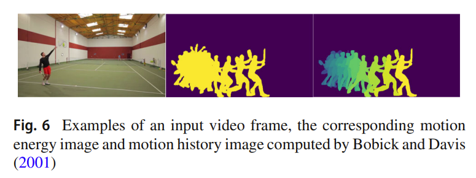

# 动作识别综述

## 参考文献

- 深度学习方法

> Zhu Y, Li X, Liu C, et al. A comprehensive study of deep video action recognition[J]. arXiv preprint arXiv: 2012.06567, 2020.）

- 手工特征方法及深度方法

> Kong, Y., & Fu, Y. (2022). Human Action Recognition and Prediction: A Survey. In International Journal of Computer Vision (Vol. 130, Issue 5, pp. 1366–1401).

- 多模态深度学习

> Sun, Z., Ke, Q., Rahmani, H., Bennamoun, M., Wang, G., & Liu, J. (2022). Human Action Recognition From Various Data Modalities: A Review. In IEEE Transactions on Pattern Analysis and Machine Intelligence (pp. 1–20). IEEE.

## 1.总论

### 1.1 动作识别的难点

1. 时间信息的表征：有些动作可以直接通过画面确定，但有些需要结合时间信息（上下文）。

2. 组内差异和组间差异都很大：视角变化会引起组内差异，同一种动作可能有不同的表现形式，而一些动作有相似性。

3. 计算存储成本高。

4. 不同模型的评估方法不同，难以对比性能。

5. 一些数据集标签不准确，同时也可能包含无标签数据。

6. 背景噪声，相机晃动。

7. 动作具有多层语义信息(movements -> atomic actions -> composite actions -> activity , etc.)

### 1.2 应用场景

- 视频监控(Visual Surveillance)
- 视频检索(Video Retrieval)
- 游戏娱乐(Entertainment)
- 人机交互(Human-Robot Interaction)
- 自动驾驶(Autonomous Driving Vehicle)

## 2. 手工特征(hand-crafted)

- 手工特征: action representation(提取特征) --> action classification(分类器)

### 2.1 action representation

#### 2.1.1 全局特征(holistic)

- Motion energy images(MEI)
- Motion history images(MHI)
- MEI,MHI对视角变化很敏感，因此提出了3D motion history volume (MHV) 来解决这个问题，通过多视角获取3D体素，然后使用傅里叶变换提取位置和旋转不变特征
 
- Optical flow
  - 稀疏光流(Lucas/Kanade)
  - 稠密光流(Horn/Schunck)

#### 2.1.2 局部特征(local)

- Space-time interest point (STIP):
    1. Laptev 将2D Harris角点检测扩展到3D，采用高斯滤波
    2. Dollar 在空间维2D高斯滤波，在时间维采用1D Gabor滤波，在兴趣点周围提取原始像素值、梯度、光流等特征并合并为一个特征向量，采用PCA降维，接着用k-means聚类，最后用SVM分类。
    3. 其他2D特征检测器扩展：3D SIFT,HOG3D
    4. 结合光流特征直方图的方法：histograms of optical flow (HOF)，motion boundary histograms (MBH，光流和梯度结合）
   
- Motion trajectory
    1. 采用光流跟踪器(KLT tracker)跟踪3DHarris关键点
    2. 匹配相邻两帧之间的SIFT特征点
    3. 将轨迹表示为HOG, HOF和MBH特征的结合体
   

### 2.2 action classification

#### 2.2.1 Direct Classification

- 词袋模型(bag-of-words model)

- 首先采用STIP检测器检测局部运动变化显著区域，然后提取光流和梯度等特征，接着采用PCA特征向量降维，采用k-means聚类生成词典，每个聚类中心为一个视觉单词,根据词典将图片或视频表示为直方图特征向量，最后用SVM分类。
- 
- 

#### 2.2.2 Sequential Approaches

- 采用顺序状态模型(sequential state model),将视频看作时间段(segments)或视频帧(frames)
- 例如：隐马尔可夫模型hidden Markov models (HMMs),条件随机场conditional random fields (CRFs)，structured support vector machine (SSVM)

#### 2.2.3 Space-time Approaches

- 主要通过STIP的时空分布来分类

#### 2.2.4 Part-based Approaches

- 主要考虑人体肢体进行分类
- 

#### 2.2.5 Manifold Learning Approaches

- 采用流形(manifold)表示人物轮廓，如MEI,MEH等特征表现为轮廓，但之前的方法表示困难，采用流形可以降维。该方法依赖整洁的人体轮廓，但在现实世界难以获得。

#### 2.2.6 Mid-Level Feature Approaches

- 在底层特征(光流，梯度等)的基础上提取高一层的特征，比如肢体语义信息、关键姿态等，缺点是需要额外的标注信息
- 

#### 2.2.7 Feature Fusion Approaches

- 融合全局特征和局部特征
- 采取多任务学习

### 2.3 Models

- IDT：一种很好的手工特征（使用手工特征+传统机器学习）。

> Wang H, Schmid C. Action recognition with improved trajectories[C]. Proceedings of the IEEE international conference on computer vision, 2013: 3551-3558.

## 2. 深度学习方法

- DeepVideo：早期使用深度学习的尝试，逐帧卷积+融合，效果不如IDT。

> Karpathy A, Toderici G, Shetty S, et al. Large-scale video classification with convolutional neural networks[C]. Proceedings of the IEEE conference on computer vision and pattern recognition, 2014: 1725-1732.

### 2.1 two-stream networks

#### 2.1.1 Two-stream convolution networks

1. 双流网络的基本思想：分别处理时间信息和空间信息+聚合。

   > Simonyan K, Zisserman A. Two-stream convolutional networks for action recognition in videos[J]. Advances in neural information processing systems, 2014, 27.

2. 光流：描述图中的有效运动部分。H\*W\*L的视频可以提取H\*W\*2L的光流。

   > Horn B K P, Schunck B G. Determining optical flow[J]. Artificial intelligence, 1981, 17(1-3): 185-203.

3. 融合策略：

   （1）late fusion：在最后作加权平均。

   （2）early fusion：在2D卷积后进行聚合（sum/max/bilinear/conv/concate）。

   > Feichtenhofer C, Pinz A, Zisserman A. Convolutional two-stream network fusion for video action recognition[C]. Proceedings of the IEEE conference on computer vision and pattern recognition, 2016: 1933-1941.

4. 深层双流网络在小数据集上克服过拟合的方法：

   （1）跨模态初始化（cross-modality initialization）。

   （2）同步批次标准化（synchronized batch initialization）。

   （3）基于角裁剪和多尺度裁剪的数据增强  （corner cropping and multi-scale cropping data augmentation）。

   （4）大dropout率（large dropout ratio）。

   > Wang L, Xiong Y, Wang Z, et al. Towards good practices for very deep two-stream convnets[J]. arXiv preprint arXiv: 1507.02159, 2015.

#### 2.1.2 Temporal segment network

- TSN：基于段（segment）的方法+片段共识（segmental consensus）。

> Wang L, Xiong Y, Wang Z, et al. Temporal segment networks: Towards good practices for deep action recognition[C]. European conference on computer vision, Springer, Cham, 2016: 20-36.

### 2.2 聚合时间信息的另一种手段——3D卷积

- 3D卷积的含义：两个时间维度+一个空间维度。

   > Ji S, Xu W, Yang M, et al. 3D convolutional neural networks for human action recognition[J]. IEEE transactions on pattern analysis and machine intelligence, 2012, 35(1): 221-231.

#### 2.2.1 C3D

- 实际应用中的3D卷积模型，耗时且标准性能不佳但泛化能力较强，常用作特征提取器。

   > Tran D, Bourdev L, Fergus R, et al. Learning spatiotemporal features with 3d convolutional networks[C]. Proceedings of the IEEE international conference on computer vision. 2015: 4489-4497.

#### 2.2.2 I3D

- I：Inflate，膨胀。使用“初始化光流”，将在ImageNet上训练的2D模型权重重映射到3D，克服训练困难的问题。

   > Carreira J, Zisserman A. Quo vadis, action recognition? a new model and the kinetics dataset[C]. Proceedings of the IEEE conference on computer vision and pattern recognition, 2017: 6299-6308.

#### 2.2.3 长程聚合

- 3D卷积存在只能聚合到卷积核覆盖的短时信息的问题，需要通过某种手段进行长程聚合。常见方法包含：

1. Non-local：残差聚合。

   > Wang X, Girshick R, Gupta A, et al. Non-local neural networks[C]. Proceedings of the IEEE conference on computer vision and pattern recognition, 2018: 7794-7803.

2. 4D CNN：视频级卷积。

   > Zhang S, Guo S, Huang W, et al. V4d: 4d convolutional neural networks for video-level representation learning[J]. arXiv preprint arXiv: 2002.07442, 2020.

#### 2.2.4 通道可分离卷积

- 高效的3D卷积。

   > Kopuklu O, Kose N, Gunduz A, et al. Resource efficient 3d convolutional neural networks[C]. Proceedings of the IEEE/CVF international conference on computer vision workshops, 2019: 0-0.

#### 2.2.5 Slow-Fast

- 快速路径（fast pathway，低帧率下的语义信息）和慢速路径（slow pathway，高帧率下的运动信息）。

   > Feichtenhofer C, Fan H, Malik J, et al. Slowfast networks for video recognition[C]. Proceedings of the IEEE/CVF international conference on computer vision, 2019: 6202-6211.

#### 2.2.6 X3D

- 更多的可调节参数（空间分辨率等）。

   > Feichtenhofer C. X3d: Expanding architectures for efficient video recognition[C]. Proceedings of the IEEE/CVF Conference on computer vision and pattern recognition, 2020: 203-213.

### 2.3 混合模型( Hybrid Networks)

#### 2.3.1 RNN

1. LRCN：使用LSTM聚合时间信息。

   > Donahue J, Anne Hendricks L, Guadarrama S, et al. Long-term recurrent convolutional networks for visual recognition and description[C]. Proceedings of the IEEE conference on computer vision and pattern recognition, 2015: 2625-2634.

## 4. 用受限的数据和标签进行学习

- 对于大规模数据集无法标注全部视频数据，并且标注可能出错

### 4.1 弱监督学习(Weakly-Supervised Action Learning)

- movie with script data,借助电影剧本进行标注
- video subtitles,视频标题
- a temporally ordered list of action classes，预先给定一个按时间顺序的动作类别表

### 4.2 无监督和自监督学习( Unsupervised and Self-Supervised Action Learning)

- 帧的时间顺序是视频中一种典型的自监督信号。
- 目标在视频中的运动也可以作为监督，比如目标的姿态

- MotionNet：无监督地学习运动信息（替代双流网络中的光流）。

> 文献：Zhu Y, Lan Z, Newsam S, et al. Hidden two-stream convolutional networks for action recognition[C]. Asian conference on computer vision. Springer, Cham, 2018: 363-378.

### 4.3 少样本学习(Few-Shot Learning)

- compound memory network (CMN)：通过检索存储在内存中的类似视频来预测未看过的视频
- GAN
- GNN
- self-attention

## 5. 多模态深度学习

- 

- 多流网络（Multi-stream networks）：更多模态（pose/object/audio/depth）

> Chéron G, Laptev I, Schmid C. P-cnn: Pose-based cnn features for action recognition[C]. Proceedings of the IEEE international conference on computer vision. 2015: 3218-3226.

## 6. 模型评价

1. 双流网络的缺陷：需要预计算光流。
2. 3D卷积：训练时间长，应用不满足实时性，不支持非GPU设备。

## 7. 数据集

1. 公认的模型评价标准：Kinetics系列、Sth-Sth系列。

2. 数据集构建：

   （1）定义动作列表（action list）。

   （2）分析视频所含动作。

   （3）记录动作的开始时间和结束时间。

   （4）去除重复样本和噪声样本。

3. 数据集构建中的难点：

   （1）行为的抽象性。

   （2）开始时间和结束时间模糊。

   （3）引用的数据集只有链接。

## 8. feature works

1. dataset，需要更复杂多样的数据集
2. 迁移图像模型，做pre-train等等
3. 学习多模态数据
4. 细粒度动作(fine-grained actions)
5. 无监督学习
6. 在开放环境下，open set action recognition
