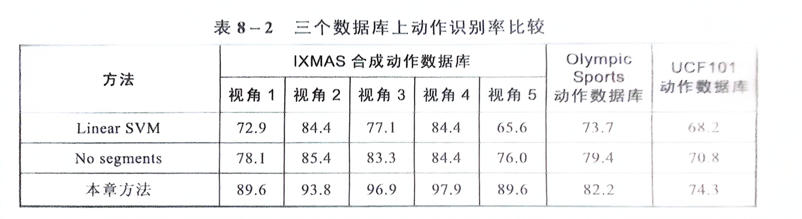

# 联合原子动作建模

## 一、引言

1. 复杂动作与原子动作：

   复杂动作：三级跳远、跳舞、三步上篮等。

   原子动作：视频中的复杂动作由一系列具有单一语义且不能再分解的简单动作组成，这类动作称为原子动作（atomic action）。如如三级跳远可以划分为三个原子动作：助跑、三个跨步和跳入沙坑。

2. 为什么研究原子动作：底层视觉特征与复杂动作的高层语义概念之间存在难以跨越的语义鸿沟。使用含有隐变量的判别式模型来表达高层动作类别、中层原子动作与底层视频段之间的内在联系。

3. 难点：

   （1）先检测原子动作，再建模复杂动作的方法：标注原子动作耗费时间且原子动作检测的误差会累积影响复杂动作的识别。

   （2）数据驱动的方法（无需预先定义原子动作，自动挖掘隐含的运动基元和原子动作）：挖掘过程缺少基于高层语义标注的指导。

## 二、相关工作

1. 原子序列模型（actom sequence model）：用原子动作周围视觉特征的直方图序列表达复杂动作的时序结构，并根据先验分布检测视频中的原子动作。

   > Gaidon A, Harchaoui Z, Schmid C. Actom sequence models for efficient action detection[C]. CVPR 2011. IEEE, 2011: 3201-3208.

2. 视频段模板匹配：使用 SVM 学习分类器和时序结构。通过优化视频段模板的时序位置，进行匹配，根据匹配程度判别复杂动作。

   > Niebles J C, Chen C W, Fei-Fei L. Modeling temporal structure of decomposable motion segments for activity classification[C]. Computer Vision–ECCV 2010: 11th European Conference on Computer Vision, Heraklion, Crete, Greece, September 5-11, 2010, Proceedings, Part II 11. Springer Berlin Heidelberg, 2010: 392-405.

3. 隐状态和相应持续时间状态建模：隐状态从底层数据中学习得到，对应于训练视频段的聚类中心。

   > Tang K, Fei-Fei L, Koller D. Learning latent temporal structure for complex event detection[C]. 2012 IEEE Conference on Computer Vision and Pattern Recognition. IEEE, 2012: 1250-1257.

## 三、联合原子动作建模

1. 联合模型构建：
   $$
   f_{\boldsymbol{w}}(\boldsymbol{x})={\max}_{y,\boldsymbol{h},\boldsymbol{g}}F(\boldsymbol{x},y,\boldsymbol{h},\boldsymbol{g})={\max}_{y,\boldsymbol{h},\boldsymbol{g}}\boldsymbol{w}^T\boldsymbol{\Phi}(\boldsymbol{x},y,\boldsymbol{h},\boldsymbol{g})\\
   其中~\boldsymbol{x}~是输入视频，y~是复杂动作分类，\boldsymbol{h}~是原子动作，\boldsymbol{g}~是视频段与原子动作的映射矩阵(隐含变量)\\
   \boldsymbol{w}~是真正的学习参数
   $$

2. 视频段 - 原子动作映射矩阵（g）：表示视频段到原子动作的映射关系。把原始视频均匀分成 R 段，关联到 V个原子动作，则 g 是一个 R \* V 的矩阵。

   对 g 做出约束：

   （1）一个视频段最多对应一个原子动作。

   （2）在该视频中出现的原子动作至少对应一个视频段。

   （3）在该视频中未出现的原子动作不对应任何视频段。

   即：
   $$
   \begin{cases}
   	\sum_{j}g_{ij}\le 1,\quad\forall{i}\\
   	\max_{i}g_{ij}=h_{j},\quad\forall{j}\\
   	g_{ij}\in\{ 0,1\} ,\quad\forall{i},\forall{j}
   \end{cases}
   $$

3. 势能函数：
   $$
   \boldsymbol{w}^T\boldsymbol{\Phi}(\boldsymbol{x},y,\boldsymbol{h},\boldsymbol{g})=\underbrace{\boldsymbol{\alpha}^T\boldsymbol{\phi}(\boldsymbol{x},\boldsymbol{g})}_{视频段-原子动作交互模型}+\underbrace{\boldsymbol{\beta}^T\boldsymbol{\psi}(\boldsymbol{x},y)}_{复杂动作模型}+\underbrace{\boldsymbol{\gamma}^T\boldsymbol{\varphi}(\boldsymbol{h},y)}_{原子动作-复杂动作关联模型}\\
   \boldsymbol{\alpha}^T\boldsymbol{\phi}(\boldsymbol{x},\boldsymbol{g})=\sum_{i=1}^{R}\sum_{j=1}^{V}\boldsymbol{\alpha}_j^T\boldsymbol{x}_i{g}_{ij}\\
   \boldsymbol{\beta}^T\boldsymbol{\psi}(\boldsymbol{x},y)=\boldsymbol{\beta}_y^T\boldsymbol{x}\\
   \boldsymbol{\gamma}^T\boldsymbol{\varphi}(\boldsymbol{h},y)=\sum_{j=1}^{V}(\gamma_{j,1}^{y}h_{j}+\gamma_{j,0}^{y}(1-h_{j}))
   $$

4. 使用 SVM 优化参数 w：
   $$
   \min_{\boldsymbol{w},{\xi}^{n}}\frac{1}{2}||\boldsymbol{w}||^2+\boldsymbol{C}\sum_{n=1}^{N}{\xi}^{n}\\
   \textrm{s.t.}\max_{\boldsymbol{g}}\boldsymbol{w}^T\boldsymbol{\Phi}(\boldsymbol{x}^{n},y^{n},\boldsymbol{h}^{n},\boldsymbol{g})-\max_{\boldsymbol{g}}\boldsymbol{w}^T\boldsymbol{\Phi}(\boldsymbol{x}^{n},y,\boldsymbol{h},\boldsymbol{g})\ge\Delta((y^{n},\boldsymbol{h}^{n}),(y,\boldsymbol{h}))-{\xi}^{n},\forall{n},\forall{y},\forall{\boldsymbol{h}}\\
   其中~\Delta((y^{n},\boldsymbol{h}^{n}),(y,\boldsymbol{h}))~是把视频~\boldsymbol{x}^{n}~预测为~(y,\boldsymbol{h})~的损失\\
   \Delta((y^{n},\boldsymbol{h}^{n}),(y,\boldsymbol{h}))=l(y^{n},y)+\sum_{j=1}^{V}l(h_{j}^{n},h_{j})\\
   \textrm{s.t.}~l(a,b)=
   \begin{cases}
   	1,\quad{a\neq b}\\
   	0,\quad{a=b}
   \end{cases}
   $$
   等价转换：
   $$
   \begin{cases}
   	\min_{\boldsymbol{w}}\frac{1}{2}||\boldsymbol{w}||^2+\boldsymbol{C}\cdot\sum_{n=1}^{N}({L}^{n}-{R}^{n})\\
   	{L}^{n}=\max_{y,\boldsymbol{h},\boldsymbol{g}}(\Delta((y^{n},\boldsymbol{h}^{n}),(y,\boldsymbol{h}))+\boldsymbol{w}^T\boldsymbol{\Phi}(\boldsymbol{x}^{n},y,\boldsymbol{h},\boldsymbol{g}))\\
   	{R}^{n}=\max_{\boldsymbol{g}^{n}}\boldsymbol{w}^T\boldsymbol{\Phi}(\boldsymbol{x}^{n},y^{n},\boldsymbol{h}^{n},\boldsymbol{g}^{n})
   \end{cases}
   $$
   采用 NRBM（Non-convex Regularized Bundle Method）求解该问题。

   NRBM 的更新梯度：
   $$
   \partial_{\boldsymbol{w}}({L}^{n}-{R}^{n})=\boldsymbol{\Phi}(\boldsymbol{x}^{n},y^{*},\boldsymbol{h}^{*},\boldsymbol{g}^{*})-\boldsymbol{\Phi}(\boldsymbol{x}^{n},y^{n},\boldsymbol{h}^{n},\boldsymbol{g}^{+})\\
   (y^{*},\boldsymbol{h}^{*},\boldsymbol{g}^{*})=\arg\max_{y,\boldsymbol{h},\boldsymbol{g}}(\Delta((y^{n},\boldsymbol{h}^{n}),(y,\boldsymbol{h}))+\boldsymbol{w}^T\boldsymbol{\Phi}(\boldsymbol{x}^{n},y,\boldsymbol{h},\boldsymbol{g}))\\
   \boldsymbol{g}^{+}=\arg\max_{\boldsymbol{g}^{n}}\boldsymbol{w}^T\boldsymbol{\Phi}(\boldsymbol{x}^{n},y^{n},\boldsymbol{h}^{n},\boldsymbol{g}^{n})
   $$
   分别求解这两个优化问题：
   $$
   对于(y^{*},\boldsymbol{h}^{*},\boldsymbol{g}^{*})=\arg\max_{y,\boldsymbol{h},\boldsymbol{g}}(\Delta((y^{n},\boldsymbol{h}^{n}),(y,\boldsymbol{h}))+\boldsymbol{w}^T\boldsymbol{\Phi}(\boldsymbol{x}^{n},y,\boldsymbol{h},\boldsymbol{g})\\
   穷举~y~的所有取值，对固定的~y~优化~h~和~g\\
   \max_{\boldsymbol{h},\boldsymbol{g}}(\Delta((y^{n},\boldsymbol{h}^{n}),(y,\boldsymbol{h}))+\boldsymbol{w}^T\boldsymbol{\Phi}(\boldsymbol{x}^{n},y,\boldsymbol{h},\boldsymbol{g})\\
   该式等价于~\max_{\boldsymbol{h},\boldsymbol{g}}\sum_{i=1}^{R}\sum_{j=1}^{V}{a}_{ij}{g}_{ij}+\sum_{j=1}^{V}b_jh_j\\
   其中~{a}_{ij}=\boldsymbol{\alpha}_j^T\boldsymbol{x}_i，b_j=
   \begin{cases}
   \gamma_{j,1}^y-\gamma_{j,0}^y-1,\quad h_{j}^{n}=1\\
   \gamma_{j,1}^y-\gamma_{j,0}^y+1,\quad h_{j}^{n}=0
   \end{cases}
   $$
   同时存在约束：
   $$
   \begin{cases}
   	\sum_{j}g_{ij}\le 1,\quad\forall{i}\\
   	\max_{i}g_{ij}=h_{j},\quad\forall{j}\\
   	g_{ij}\in\{ 0,1\} ,\quad\forall{i},\forall{j}\\
   	h_{j}\in\{ 0,1\} ,\quad\forall{j}
   \end{cases}
   $$

   $$
   其中~\max_{i}g_{ij}=h_{j},\forall{j}~不是凸问题，将其放松约束为~g_{ij}\le h_{j}\le\sum_{i}g_{ij},\forall{i},\forall{j}
   $$

   这是一个整型约束问题，为了方便求解，可以进一步放松约束为线性规划问题：
   $$
   \max_{\boldsymbol{h},\boldsymbol{g}}\sum_{i=1}^{R}\sum_{j=1}^{V}{a}_{ij}{g}_{ij}+\sum_{j=1}^{V}b_jh_j\\
   \textrm{s.t.}\begin{cases}
   	\sum_{j}g_{ij}\le 1,\quad\forall{i}\\
   	g_{ij}\le h_{j}\le\sum_{i}g_{ij},\quad\forall{i},\forall{j}\\
   	0\le g_{ij}\le 1 ,\quad\forall{i},\forall{j}\\
   	0\le h_{j}\le 1 ,\quad\forall{j}
   \end{cases}
   $$

   $$
   求解后对~g_{ij}~取整，令~h_{j}=\max_{i}g_{ij}，得到最终解\\
   同理求解g^{+}
   $$

5. 联合模型预测：
   $$
   (y^{*},\boldsymbol{h}^{*})=\arg\max_{y,\boldsymbol{h}}(\max_{\boldsymbol{g}}\boldsymbol{w}^T\boldsymbol{\Phi}(\boldsymbol{x},y,\boldsymbol{h},\boldsymbol{g}))
   $$

## 四、结果

