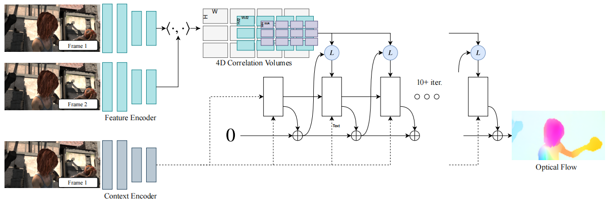
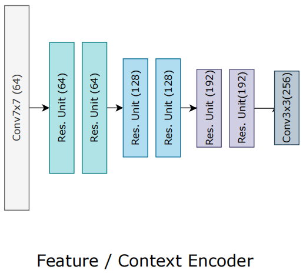
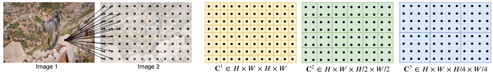
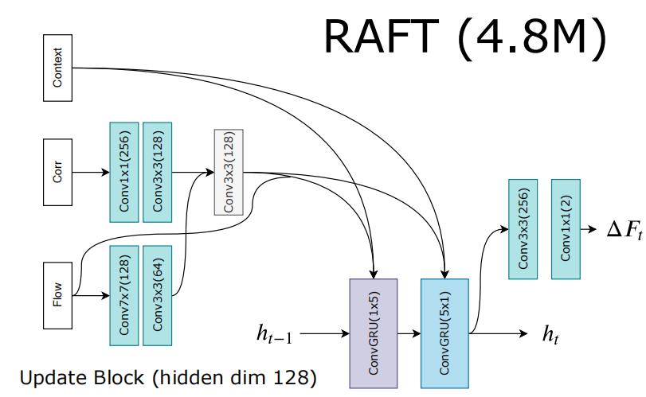

# 递归全对场变换（RAFT）

> Teed Z, Deng J. Raft: Recurrent all-pairs field transforms for optical flow[C]. European conference on computer vision (ECCV). Springer, Cham, 2020: 402-419.

## 一、引言

1. 光流提取中的难点：

   （1）高速移动的物体。

   （2）遮挡。

   （3）运动模糊。

   （4）无纹理表面。

2. 手工提取光流需要制定data与regularization的权衡优化问题。

   （1）data：帧间相似区域的匹配。

   （2）regularization：先验的运动合理性判据。

3. 深度学习提取光流可以规避制定优化问题，通过训练网络直接预测流量。

## 二、相关工作

1. Horn-Schnuck算法：
   $$
   argmin(\nabla F\cdot V+F_t)^2+\lambda^2\sum_{x,y}(||\nabla u||_2^2+||\nabla v||_2^2
   $$
   迭代优化：
   $$
   u^{k+1}=\bar{u}^k-\frac{F_x(F_x\bar{u}^k+F_y\bar{v}^k+F_t)}{\lambda^2+F_x^2+F_y^2}\\
   v^{k+1}=\bar{v}^k-\frac{F_y(F_x\bar{u}^k+F_y\bar{v}^k+F_t)}{\lambda^2+F_x^2+F_y^2}
   $$
   存在问题：过度平滑、噪声敏感。

2. Anandan：稳健估计框架。

   存在问题：单一估计、仅适用于小位移（依旧假设光流平滑）。

3. 图像金字塔（image pyramid）：coarse-to-fine strategy，从粗到精，先在低分辨率下估计大位移，再在高分辨率下细化小位移。

   存在问题：错失高速运动的小物体、难以从早期错误中恢复。

4. 深度学习方法：直接预测流场，回避优化问题。

   17 CVPR：Flownet

   18 CVPR：Pwc-net

   18 CVPR：Liteflownet

   19 CVPR：IRR

   19 NIPS：Volumetric correspondence

   20 ECCV：Pyramidal level

   20 ECCV：RAFT

## 三、RAFT

1. RAFT端到端可训练（全可微）。

2. 特征提取器：Conv + 6 \* Res + Conv。从H \* W \* 3的原始RGB图转为(H / 8) \* (W / 8) \* D的特征图，文章中D取256。

3. 视觉相似度：使用点积计算相似度。给定两张H \* W \* D的特征图，点积得到的4D相似度为H \* W \* H \* W。
4. 多尺度特征图（相似度金字塔）：在后两个维度上进行池化，将H \* W \* H \* W缩放为H \* W \* (H / 2) \* (W / 2)、H \* W \* (H / 4) \* (W / 4)、H \* W \* (H / 8) \* (W / 8)，前两个维度不变用于高分辨率维持（保留高分辨率下的信息，实现同时更新高分辨率与低分辨率）。

5. 迭代更新：使用GRU单元迭代更新，GRU的输出为光流的更新量，将其与该层的光流输入相加得到下一层的光流输入。

## 四、结果

1. 性能：KITTI上的F1-all达到5.10%，Sintel的end-point-error达到2.855像素。
2. 泛化力：在合成数据上训练，在KITTI上测试，end-point-error达到5.04像素。
3. 效率：单1080Ti的状态，正常版本10FPS，轻量版本20FPS。